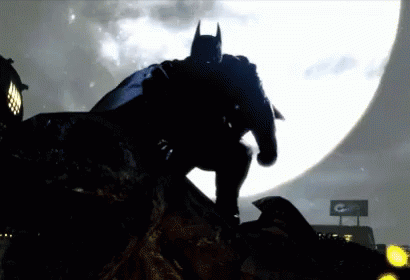

  

<h1 align="center">S. Lakshmi Ganesh</h1>

  <strong>Building dependable AI learning systems, full-stack products, and developer tools.</strong>

  

  <a href="https://github.com/SLakshmiGanesh">GitHub</a> &middot;
  <a href="https://slakshmiganesh.github.io/SLakshmiGanesh/">Portfolio</a>

## Mission Control

Computer Science student working across Python, TypeScript, Next.js, FastAPI, PostgreSQL, and modern AI workflows. My focus is adaptive education, retrieval-augmented generation, and practical engineering that holds up beyond the demo.

| Area | Focus |
| --- | --- |
| AI systems | Adaptive learning, RAG, personalized feedback |
| Backend | Python, FastAPI, async services, PostgreSQL |
| Product engineering | Next.js, TypeScript, real-time web experiences |
| Problem solving | Competitive programming, security challenges |

## Featured Projects

### Adaptive Prep Platform

An AI-driven exam preparation platform that adapts practice, revision, and feedback to each learner.

- Adaptive recommendation engine using BKT, IRT, and SM-2 spaced repetition
- RAG-based doubt solving and personalized explanations
- Next.js frontend with an asynchronous Python backend
- Streaming responses through Server-Sent Events

`Next.js` `TypeScript` `Python` `FastAPI` `PostgreSQL` `RAG` `SSE` `pytest`

### CP Mentor AI

An AI-assisted competitive programming mentor for structured problem-solving practice. It emphasizes guided hints, topic-based practice, and progress tracking instead of simply returning answers.

`React` `TypeScript` `AI` `Competitive Programming`

### CTF Arena: Level 1

A self-contained browser CTF challenge for beginner cryptography practice, with a terminal-style interface, a ROT13 prompt, flag validation, and progress feedback.

- [Launch the challenge](https://slakshmiganesh.github.io/SLakshmiGanesh/games/ctf-arena-level1.html)
- [View its source](games/ctf-arena-level1.html)

`HTML` `CSS` `JavaScript` `CTF` `Cryptography`

## Current Operations

- Deploying the Adaptive Prep Platform with a live frontend and backend
- Improving CP Mentor AI with a Vite-based frontend and stronger product polish
- Building stronger CI, architecture documentation, and production-quality project presentation

  

<i>Build quietly. Ship reliably.</i>

